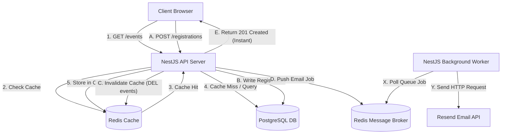
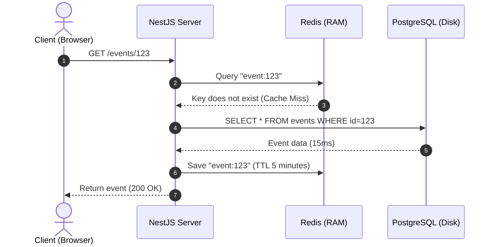
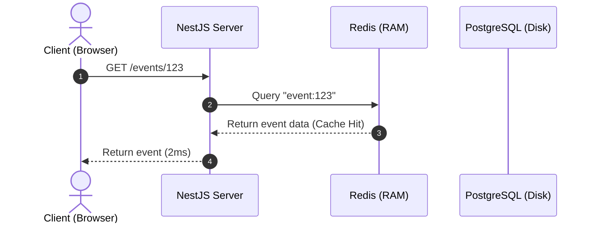
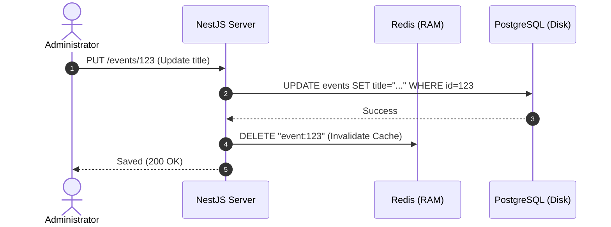

# Architecture Optimization: Redis & BullMQ

This document contains the detailed technical proposal, implementation plan, and justification for integrating Redis (Cache-Aside Caching) and BullMQ (Message Queue) to scale the backend of the event management system.

---

## 1. Technical Justification

### The Current Concurrency Bottleneck
Currently, the backend experiences increased response times (reaching p95 of 10 seconds) under a load of 100 concurrent users due to two factors:

1. **Event Loop Starvation (Single-Thread Blockage)**:
   When a user registers, the server triggers an email dispatch using the Resend API (`this.resend.emails.send()`). Although this operation is not awaited in the main HTTP request loop (it runs with a `void` prefix), Node.js (which is single-threaded) must still manage the network connection (DNS resolution, TCP connection, and especially the SSL/TLS cryptographic handshake which is CPU-intensive). Attempting to open 100 HTTPS connections simultaneously saturates the CPU. As a result, database queries and other simple HTTP requests wait in line in the Event Loop queue.
2. **Database Connection Pool Exhaustion**:
   Prisma has a limit on concurrent connections to the database (PostgreSQL). When 100 requests arrive at the same time, most must wait in a queue for a connection to be freed, adding latency.

### How this Proposal Solves it
- **Redis Cache (Reads)**: Stores event queries in memory. It completely avoids querying PostgreSQL and using the Prisma connection pool. Read queries resolve in under 5ms.
- **BullMQ (Writes)**: Instead of processing email dispatches directly in the API process loop, the server creates the record in PostgreSQL, pushes a lightweight job to the Redis queue (takes less than 1ms), and responds immediately to the client. The email sending is handled in small concurrent batches (e.g., 5 at a time) in the background by a Worker.

---

## 2. New Architecture Flowcharts

### General Architecture (Reads & Writes)



---

### Detailed Read Flow (GET)

#### Scenario A: First time an event is requested (Cache Miss)



#### Scenario B: Subsequent queries for the same event (Cache Hit)



#### Scenario C: Event update and invalidation



---

## 3. Step-by-Step Implementation Plan

### Infrastructure

1. **Modify docker-compose.yml**
   Add the Redis service to your local compose file:
   ```yaml
   redis:
     image: redis:7-alpine
     container_name: event-manager-redis
     ports:
       - "6379:6379"
     volumes:
       - redisdata:/data
   ```
2. **Environment Variables**
   Add these to `backend/.env` and `backend/.env.example`:
   ```env
   REDIS_HOST=localhost
   REDIS_PORT=6379
   REDIS_URL= # Optional locally, required in production (e.g., Upstash/Redis Cloud)
   ```
3. **Configuration Validation**
   Modify `backend/src/common/config/env.validation.ts` to validate `REDIS_HOST` and `REDIS_PORT`.

### Dependencies

From the `backend/` directory, run the package installations:
```bash
npm install @nestjs/cache-manager cache-manager cache-manager-redis-yet @nestjs/bullmq bullmq ioredis
```

### Backend Code

1. **Global Configuration (`app.module.ts`)**
   - Globally import `CacheModule` utilizing `cache-manager-redis-yet` pointing to your environment variables.
   - Globally import `BullModule` pointing to your Redis connection.
2. **Implement Cache-Aside Caching (`events.service.ts`)**
   - Inject `CACHE_MANAGER`.
   - Update `findAll` and `findById` to check Redis first. On cache miss, query Postgres, save it in Redis with a 300-second TTL (5 minutes), and return.
   - Update `create`, `update`, and `delete` to delete the affected cache keys in Redis.
3. **Message Queues (`registrations.module.ts` & `registrations.service.ts`)**
   - Register `'mail-queue'` in `registrations.module.ts`.
   - Inject the queue in `registrations.service.ts` using `@InjectQueue('mail-queue') private mailQueue: Queue`.
   - Update the `register()` method to call `await this.mailQueue.add('send-confirmation', { eventId, userId, registrationId })` instead of directly triggering the email service.
4. **Queue Processor (`mail.processor.ts`)**
   - Create `backend/src/notifications/mail.processor.ts` decorated with `@Processor('mail-queue')`.
   - Implement `process(job)` which extracts metadata and triggers `NotificationsService.sendRegistrationConfirmation(...)` asynchronously.
5. **Exports (`notifications.module.ts`)**
   - Export `NotificationsService` and register the new `MailProcessor` provider.

---

## 4. Free Production Deployment (Vercel, Render, & Supabase)

- **Cloud Redis**: Because you are on Vercel/Render free tiers, you cannot run persistent Redis on Render free instances. You should create a free Redis database in the cloud using **Upstash** or **Redis Labs** (which offer up to 10,000 requests per day or 30MB of storage on their free tiers).
- **Render Variables**: Add the `REDIS_URL` environment variable in the Render Dashboard pointing to your cloud instance.
- **Keep-Alive Cron**: Your existing 9-minute cron job keeping your Render backend active will ensure the BullMQ Worker background processes continue running and handling queue items without getting suspended.
