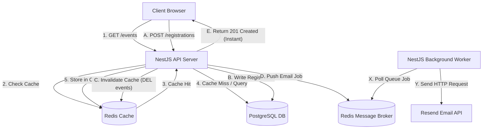
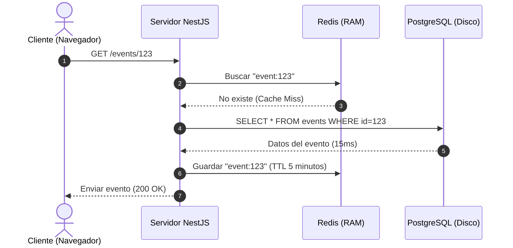
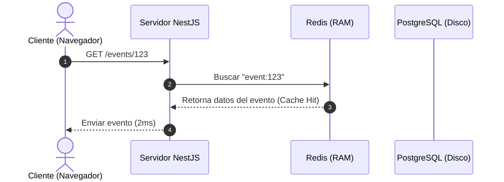
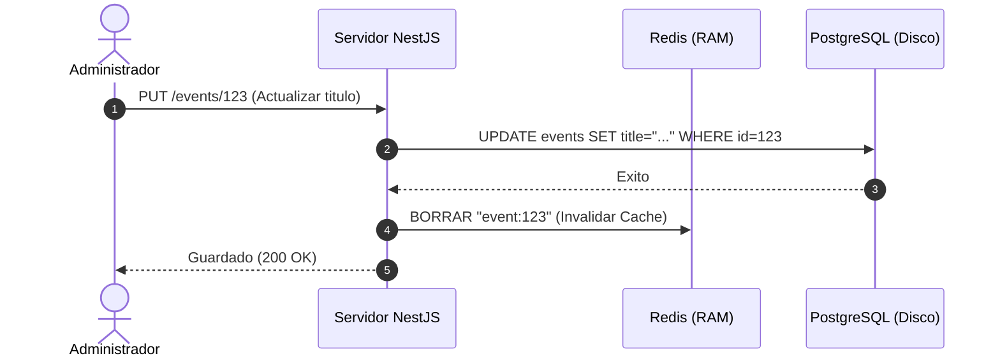

# Optimizacion de Arquitectura: Redis y BullMQ

Este documento contiene la propuesta tecnica detallada, el plan de implementacion y la justificacion del uso de Redis (Cache-Aside) y BullMQ (Cola de Mensajeria) para escalar el backend del sistema de gestion de eventos.

---

## 1. Justificacion Tecnica del Rendimiento

### El Problema Actual bajo Concurrencia
Actualmente, el backend experimenta un aumento en los tiempos de respuesta (llegando a p95 de 10 segundos) bajo una carga de 100 usuarios concurrentes debido a dos factores:

1. **Saturacion del Hilo de Ejecucion (Event Loop Starvation)**:
   Al registrarse un usuario, el servidor realiza de forma asincrona un envio de correo a traves de la API de Resend (`this.resend.emails.send()`). Aunque esta operacion no se espere en el hilo de respuesta HTTP del cliente (se ejecuta con un prefijo void), Node.js (que es monohilo) debe gestionar la conexion de red (resolucion DNS, conexion TCP y sobre todo la negociacion SSL/TLS que requiere mucho procesamiento de CPU). Al intentar abrir 100 conexiones HTTPS salientes simultaneamente, la CPU se satura resolviendo criptografia. Las consultas de base de datos normales se quedan en cola esperando turno en el Event Loop.
2. **Agotamiento del Pool de Conexiones de Base de Datos**:
   Prisma tiene un limite de conexiones simultaneas a la base de datos (PostgreSQL). Al recibir 100 peticiones en paralelo, la gran mayoria debe esperar en cola a que se libere una conexion, sumando segundos de latencia.

### Como lo soluciona esta propuesta
- **Redis Cache (Lecturas)**: Almacena las consultas de eventos en memoria RAM. Evita por completo realizar consultas a PostgreSQL y evita utilizar el pool de conexiones de Prisma. Las consultas toman menos de 5ms.
- **BullMQ (Escrituras)**: En lugar de procesar los envios de correos directamente en el hilo de la API, el servidor crea el registro en PostgreSQL, ingresa una tarea liviana en la cola de Redis (toma menos de 1ms) y responde inmediatamente al cliente. El envio de correos se procesa en lotes pequeños (por ejemplo, de 5 en 5) en segundo plano por un Worker, protegiendo al procesador principal.

---

## 2. Diagramas de Flujo de la Nueva Arquitectura

### Arquitectura General (Lecturas y Escrituras)



---

### Flujo Detallado de Lecturas (GET)

#### Escenario A: Primera vez que se consulta un evento (Fallo de Cache / Cache Miss)



#### Escenario B: Consultas posteriores del mismo evento (Acierto de Cache / Cache Hit)



#### Escenario C: Actualizacion del evento e invalidacion



---

## 3. Plan de Implementacion Paso a Paso

### Infraestructura

1. **Modificar docker-compose.yml**
   Añadir el servicio de Redis en el archivo de orquestacion local:
   ```yaml
   redis:
     image: redis:7-alpine
     container_name: event-manager-redis
     ports:
       - "6379:6379"
     volumes:
       - redisdata:/data
   ```
2. **Variables de Entorno**
   Añadir en `backend/.env` y `backend/.env.example`:
   ```env
   REDIS_HOST=localhost
   REDIS_PORT=6379
   REDIS_URL= # Opcional en local, requerido para produccion (ej. Upstash/Redis Cloud)
   ```
3. **Validacion de Configuracion**
   Modificar `backend/src/common/config/env.validation.ts` para agregar y validar `REDIS_HOST` y `REDIS_PORT`.

### Dependencias

En la carpeta `backend/` ejecutar la instalacion de paquetes:
```bash
npm install @nestjs/cache-manager cache-manager cache-manager-redis-yet @nestjs/bullmq bullmq ioredis
```

### Codigo del Backend

1. **Configuracion Global (`app.module.ts`)**
   - Importar `CacheModule` globalmente utilizando `cache-manager-redis-yet` apuntando a las variables de entorno.
   - Importar `BullModule` apuntando a la conexion de Redis.
2. **Implementar Cache-Aside (`events.service.ts`)**
   - Inyectar `CACHE_MANAGER`.
   - Modificar `findAll` and `findById` para leer de Redis primero. Si hay fallo de cache, leer de la base de datos, escribir en Redis con un TTL de 300 segundos (5 minutos) y retornar.
   - Modificar `create`, `update` y `delete` para borrar las claves afectadas de Redis.
3. **Colas de Mensajeria (`registrations.module.ts` y `registrations.service.ts`)**
   - Registrar la cola `'mail-queue'` en `registrations.module.ts`.
   - Inyectar la cola en `registrations.service.ts` usando `@InjectQueue('mail-queue') private mailQueue: Queue`.
   - Modificar el metodo `register()` para que, en lugar de llamar de forma directa a la funcion de correo, llame a `this.mailQueue.add('send-confirmation', { eventId, userId, registrationId })`.
4. **Procesador de Colas (`mail.processor.ts`)**
   - Crear el archivo `backend/src/notifications/mail.processor.ts` con el decorador `@Processor('mail-queue')`.
   - El procesador ejecutara el metodo `process(job)` llamando internamente a `NotificationsService.sendRegistrationConfirmation(...)` de forma secuencial o controlada (con limites de concurencia).
5. **Exportaciones (`notifications.module.ts`)**
   - Exportar `NotificationsService` y registrar `MailProcessor` como proveedor.

---

## 4. Despliegue Gratuito en Produccion (Vercel, Render y Supabase)

- **Redis en la nube**: Al estar en Vercel/Render en planes gratuitos, no se puede correr Redis en el mismo servidor de Render de forma persistente. Se debe crear una instancia gratuita de Redis en la nube usando proveedores como Upstash o Redis Labs (que ofrecen hasta 10,000 llamadas al dia o 30MB en planes gratuitos).
- **Render Variable**: Agregar la variable de entorno `REDIS_URL` en la configuracion de Render apuntando a tu instancia de Upstash.
- **Mantener Vivo el Servidor (Cron Job)**: El cron job de 9 minutos que ya tienes funcionando seguira activo y mantendra encendido el servidor NestJS de Render, garantizando que el Worker de BullMQ procese las colas constantemente sin suspenderse.
